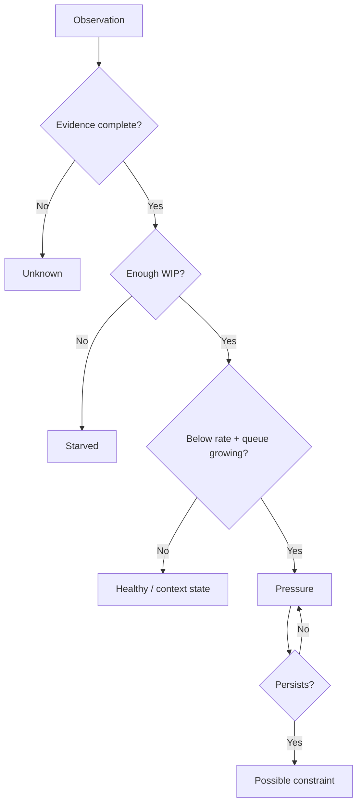

# Leather Production Flow Pilot

A local-first decision-support prototype for two recurring manufacturing questions:

1. **Where does production flow show persistent pressure?**
2. **What recorded conditions contributed time, quality, or output evidence without double-counting or inventing causality?**

The prototype is framed around leather-goods manufacturing, but the included dataset is fully synthetic. It has **not** been deployed at, validated by, or endorsed by any leather-goods manufacturer.

## Why this project exists

Small and medium manufacturing operations often do not need an ERP replacement to learn something useful. They may need a narrow instrument that turns a few disciplined observations into a reproducible signal.

This project therefore keeps the input contract intentionally small:

- good output for an observation interval
- WIP waiting before an operation
- interval duration and stop context
- timestamped blocking events
- quality/rework disposition
- shift target and actual good output

The software is designed to say **Unknown** when evidence is missing rather than silently turning missing evidence into zero.

## Two instruments, one narrow pilot

### A. Production Flow Radar

The Radar compares observed calendar rate with a configured required rate and interprets that rate together with WIP availability and queue movement.

A simplified state path is:



A **Possible constraint** is an investigation signal. It is not proof of root cause, worker blame, or causal lost output.

### B. Production Loss Accounting

The loss view deliberately keeps unlike quantities separate:

- **Plan gap:** `max(0, target - actual good output)`
- **Blocking time:** timestamped event minutes
- **Quality genealogy:** first-pass failures split into recovered, final reject, or still in rework

Overlapping disturbance events are segmented by clock time. If different categories overlap, the shared segment becomes `OVERLAP_UNRESOLVED` rather than being counted twice or arbitrarily assigned.

## Engineering safeguards

| Failure risk | Protection in the prototype |
|---|---|
| Missing value treated as zero | Missing evidence remains `UNKNOWN` |
| Biggest queue called the bottleneck | Requires rate deficit + growing queue |
| Reacting to one noisy interval | Persistent pressure is required for `POSSIBLE_CONSTRAINT` |
| Starved station blamed for low output | Low WIP + low rate becomes `STARVED` |
| Planned batch mistaken for congestion | Intentional buffer has its own state |
| Downtime double-counted | Event intervals are unioned/segmented |
| Overlap assigned without evidence | Shared time becomes `OVERLAP_UNRESOLVED` |
| Rework and rejects both counted as final loss | Quality conservation is enforced |
| Wrong entry silently overwritten | Correction retains revision and audit history |
| Closed shift casually edited | Reopening requires a reason |
| Improvement claimed as causation | Intervention records observed outcome only |

## Quality conservation

For each recorded quality cohort:

```text
first-pass failures = recovered after rework + final rejects + still in rework
```

Example: 10 first-pass failures, 8 recovered, 2 rejected, 0 still in rework is balanced. The final reject count is 2—not 12.

## Run locally

No external packages or paid services are required.

```bash
python3 -m http.server 8080
```

Then open:

```text
http://localhost:8080
```

A convenience build, `Flow-Pilot-One-File.html`, is also included for a simple single-file demonstration.

## Run the regression tests

A current Node.js runtime is required.

```bash
npm test
```

The regression suite covers persistent pressure, starvation, missing evidence, planned buffering, plan variance, interval union, nested/adjacent/cross-midnight timing, overlapping causes, operation scoping, quality conservation, and invalid negative production.

## Repository map

```text
index.html                 App shell
styles.css                 Responsive presentation
src/engines.js             Deterministic production/loss rules
src/fixture.js             Synthetic leather-goods demo
src/app-v03.js             Local UI, audit, quality and shift lifecycle
tests/engines.test.mjs     Regression barrier
docs/USER_MANUAL.md        Shop-floor use cases and operating rules
docs/PILOT_BOUNDARIES.md   What this prototype can and cannot establish
Flow-Pilot-One-File.html   Convenience single-file build
```

## Privacy and operating boundary

The current prototype is deliberately local:

- no backend
- no user accounts
- no shared database
- no ERP connection
- no multi-device synchronization
- no telemetry or analytics service
- no real factory dataset in this repository

Manual entries stay in the browser on the device. The local export function creates a JSON backup on that device.

Real company data should only be entered with the relevant company's permission and an agreed data-handling procedure.

## Validation status

**Implemented and regression-tested:** deterministic rule engine, synthetic demo, local pilot workflow, issue timing, overlap-safe Pareto logic, quality conservation, correction history, shift close/reopen controls and intervention outcome notes.

**Not established:** real-factory accuracy, productivity uplift, causal effect on output, multi-user reliability, enterprise security, ERP integration or production deployment.

The next legitimate validation step is a permissioned, narrow factory pilot with predefined baseline measures and pass/fail criteria.

## Documentation

- [User manual](docs/USER_MANUAL.md)
- [Pilot boundaries and interpretation](docs/PILOT_BOUNDARIES.md)

## Author

**Peeyoosh Raj**  
Industrial & Production Engineer with experience in EdTech teaching, currently building practical tools around manufacturing, supply chain and operations analytics.

## License

No open-source license is granted at this stage. The repository is public for portfolio review and technical discussion; licensing can be reconsidered if the project moves toward collaboration or deployment.
